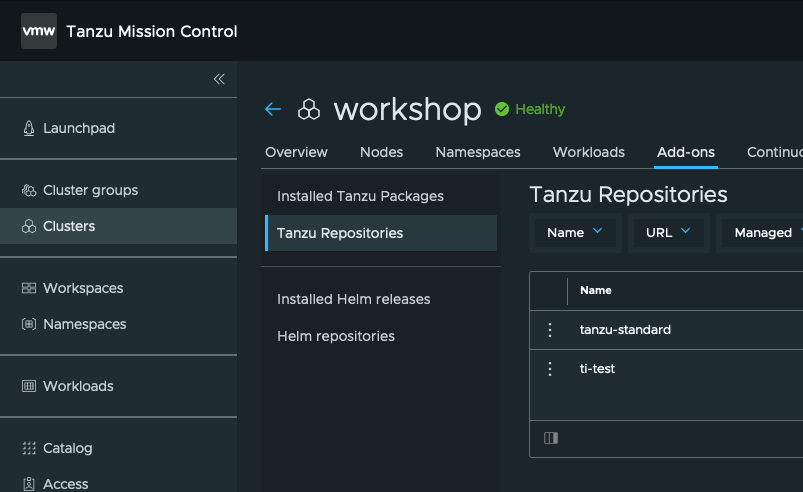
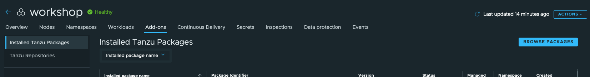
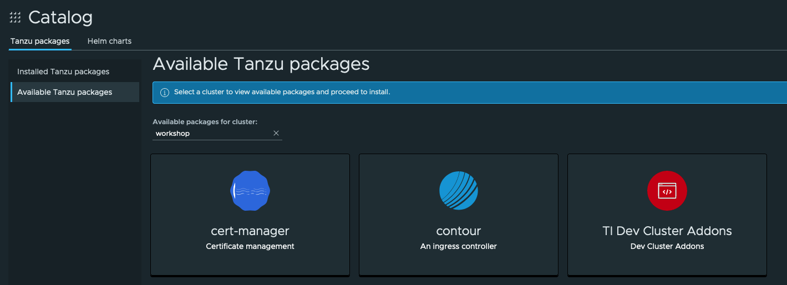
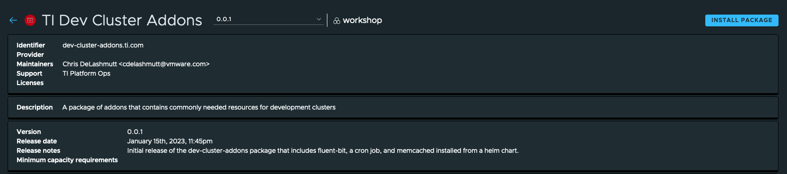
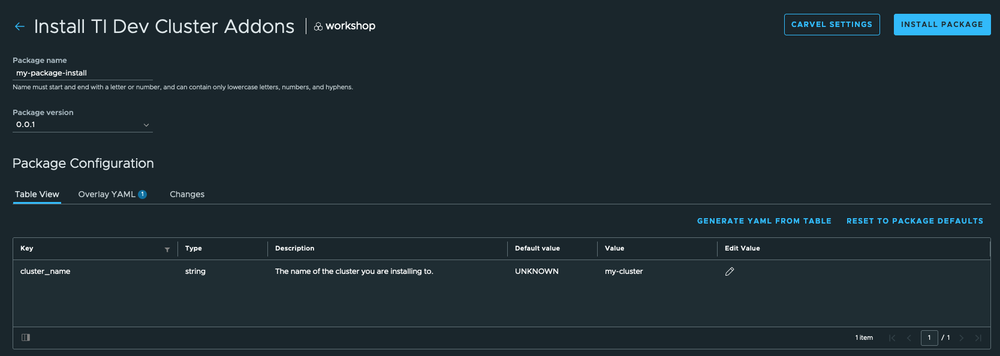

# A sample Carvel Package Repository
This git repo contains the source for a simple Carvel [kapp-controller](https://carvel.dev/kapp-controller/) Package Repository.  Package repositories let you present Packages, which are bundles of Kubernetes manifests and OCI images that can be installed to a Kubernetes cluster.

## Structure
The `packages` directory contains sub-directories cooresponding to different packages we want this repo to expose.

The `.imgpkg` directory is used to capture idempotent image identifiers to any OCI images or bundles this repository refers to.  This is primarily for capturing published package bundle SHAs.

There is no magic to this particular folder structure.  I chose this structure as it is similar to the one presented by the kapp-controller tutorial, and it makes it simple to know which resources go to which package we want to publish via the repo.  When this package repository is installed in your cluster, all folders are scanned for packaging meta-data resources (packages and their versions) to apply to the cluster.

## Publishing the repo
Any time you want to add new packages or new versions of existing packages, you will need to use the [`kbld`](https://carvel.dev/kbld/) and [`imgpkg`](https://carvel.dev/imgpkg/) utilities.  Before publishing, you need to run the `kbld` utility to "lock" any package image bundle references that this repository is using, and then the `imgpkg` utility to publish it.  You will need to modify the `imgpkg` command to use the URL of a registry that you have access to push packages to.

You can run the following command to generate the lock file:
```
kbld -f packages/ --imgpkg-lock-output .imgpkg/images.yml
...
imgpkg push -b ghcr.io/cdelashmutt-pivotal/ti-package-repo:0.0.1 -f .
```

### The `kbld` utility
The `kbld` utility scans yaml files for anything that looks like the coordinates of an OCI image, and resolves that image to a particular, idempotent SHA256 reference.  This is to enable package version references to remain static and only modified when intended.  Any references to images that use tags will get put into mapping file that can be used later on by kapp-controller to get the specific package bundle image that was referenced at the time of publishing.

### The `imgpkg` utility
The `imgpkg` utility scans bundles up all the files in a directory and stores them in an OCI image format in an image registry.  It's primarly leveraging an OCI image registry as an archive storage mechanism, and not creating a runnable container image.

## Consuming this PackageRepository
### Via Tanzu Mission Control
Tanzu Mission Control makes it simple to expose custom packages to your cluster users.  After provisioning or attaching a cluster to TMC, you can navigate to the cluster you want to install packages on, and go to the "Add-ons" tab for that cluster, and select the "Tanzu Repositories" item from the navigation list for the cluster.  



From there, you can select the "Add Package Repository" button on the right side of the screen to bring up a dialog to add in your published package repository location.  This location needs to be the same location as you published your package repository using `imgpkg`.

**Note:** If the repository you publish your package repo to requires authentication, you will need to make sure to create a secret with at least read-only credentials that can pull from your registry.  You can easily do this from Tanzu Mission Control's "Secrets" tab for you cluster, and then export the secret to all namespaces.

After adding your repository, you can go to the "Installed Tanzu Packages" item from the navigation list for the cluster. There, you can click on the "Browse Packages" button to select any packages your repository provides for install.



Clicking on "Browse Packages" will take you to a screen to select from all the packages that are available for this cluster.  You can select any packages your repository is publishing to continue the install process.



After selecting a package, you are then brought to a screen to see more details about your package, and to allow to select the version of your package you want to install.  After you select the version you want, you can then click the "Install Package" button on the right side of the screen to configure any exposed settings for the package.



On the next screen, you'll get a dialog that allows you to give your install a name in the cluster, and then specify any settings allowed for you package.  Settings can be specified via the table view or via a YAML format in the "YAML Overlay" view.  After you are satisfied with your settings, you can click the "Install Package" button to have the package installed to your cluster.




### Manual Consumption
You will need to create a [PackageRepository](https://carvel.dev/kapp-controller/docs/latest/packaging/#package-repository) object, a[PackageInstall](https://carvel.dev/kapp-controller/docs/latest/packaging/#package-install) object, and a ServiceAccount with the necessary priviledges to manage whatever objects your package installs.  You can find an example of this process in the [kapp-controller tutorial for packages](https://carvel.dev/kapp-controller/docs/latest/packaging-tutorial/#adding-a-packagerepository)